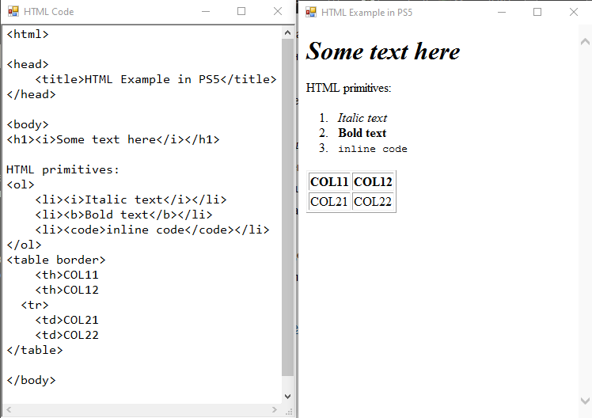
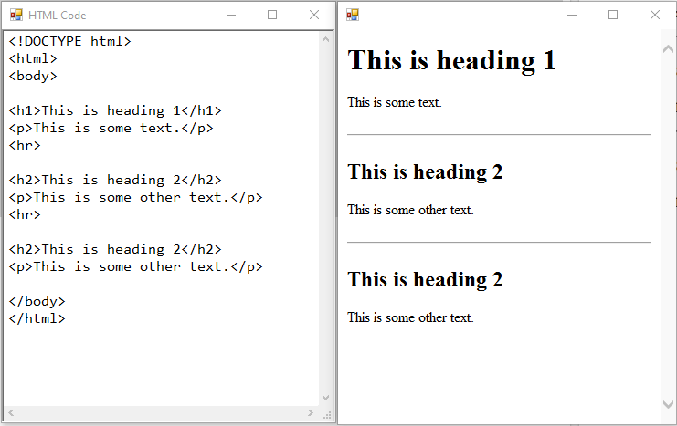
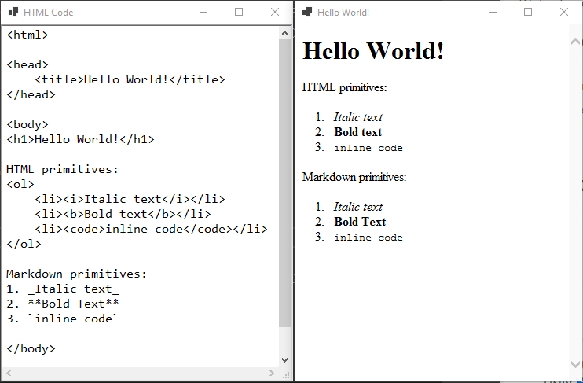
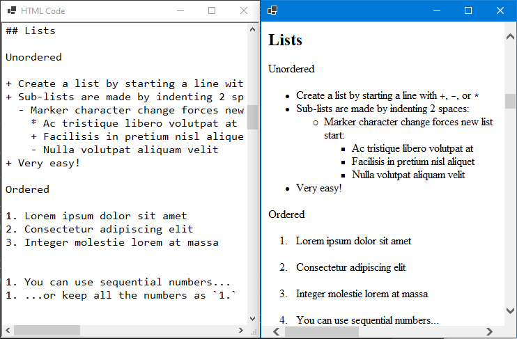

# ps-webbrowser

Simple script to open two windows to write HTML/Markdown and chek how it works.

_Writen for powershell_

## How to use

1. Get Windows (not UNIX)[^1]
2. Get any version of PowerShell (*should already be in Windows*)
3. For **PS version 1.0** and **2.0** you need to run with `-STA` parametr for WinForms components

## Examples

1. HTML in powershell 5  
    

1.  HTML in powershell 5  
    

1.  HTML and Markdown in powershell 7  
    

1.  HTML and Markdown in powershell 7  
    

[^1]: Current *dotnet* runtime (3.1) don't support Windows Forms or WPF on UNIX.
